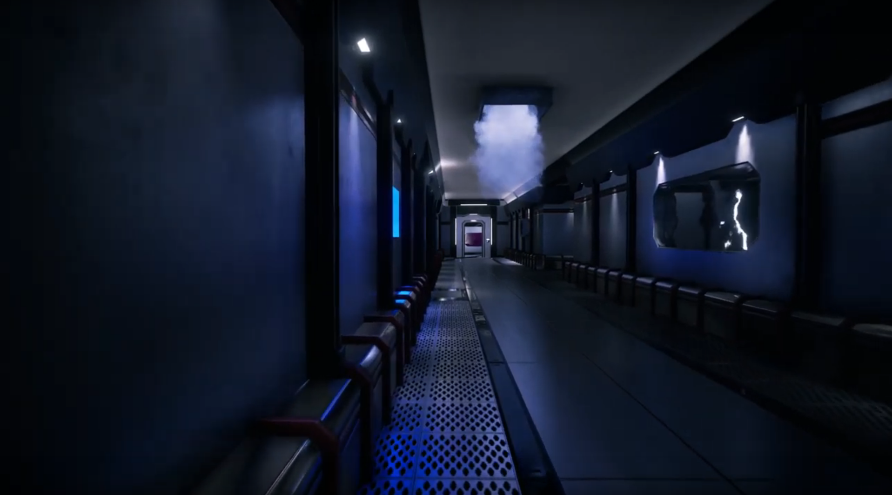

# The Loop Paradox

This is a student game made for a game design course. The story was written in 4 months part time, the game was implemented in 2-3 months full time (more or less).
When playing the game, you will have no idea about the story, because story telling AND game programming together is damn hard.
> Maybe you are the monster 

But you will feel the space atmosphere and have extraterrestrial encounters and a abandoned space ship. The main focus was on damn good graphics, why we gave everything a 4k texture. Now the game is way too big.

Check out the trailer

